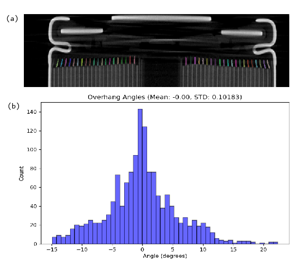
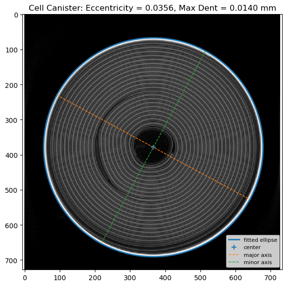
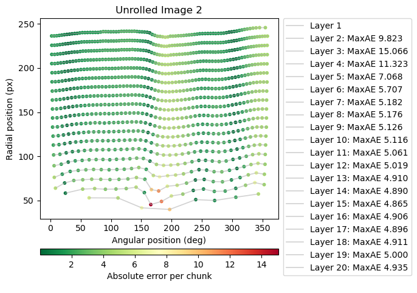

# Summary

X-ray computed tomography (XCT) is a powerful tool for non-destructive characterization of lithium-ion batteries, enabling three-dimensional visualization of cell components and microstructural features [@attia2025challenges]. However, translating XCT images into quantitative insights often requires custom analysis workflows that are not openly available, limiting reproducibility and reuse.

This submission provides a set of open Jupyter notebooks that demonstrate analysis workflows for battery XCT data. The workflows focus on three tasks:
(1) quantifying electrode overhang in cylindrical cells to assess manufacturing quality through multiple geometric measurements, 
(2) measuring the cannister and detecting dents in the cannister via an ellipse fit, 
(3) unrolling 2D slices of cylindrical cell “jelly rolls” into polar coordinates (radial distance, angle) [@kok2019virtual], including fitting of an ideal spiral to quantify deviations from the expected geometry [@sun2025health], and 
(4) analyzing gray-level variations in radial layers of cracked nickel–manganese–cobalt (NMC) particles, with the ability to process and compare a large number of particles to reveal population-level trends [@jones2024multilabel;@wade2022great]. Each workflow is implemented as a notebook and accompanied by example data, including images and, where relevant, segmentation masks, so that they can be executed without specialized preprocessing.

The notebooks are implemented in Python and make use of widely adopted scientific libraries, including NumPy [@harris2020numpy], SciPy [@virtanen2020scipy], scikit-image [@van2014scikit], Matplotlib [@hunter2007matplotlib], and scikit-learn [@pedregosa2011scikit]. By focusing on clarity and reproducibility, they are intended both as ready-to-use analysis workflows for battery researchers and as adaptable templates for the wider tomography and x-ray imaging communities. All notebooks and supporting data are archived with a Zenodo DOI to ensure long-term accessibility.

By lowering the barrier to quantitative XCT analysis, these example workflows promote transparent and reproducible research in battery science, and they may also serve as a starting point for similar analyses in other domains of materials tomography.

# Statement of need

X-ray computed tomography (XCT) is increasingly used in battery research to visualize cell components and degradation phenomena. While raw XCT data are widely generated, reproducible analysis workflows remain scarce. Newcomers to the technique often struggle to move beyond qualitative inspection, and many research groups rely on different proprietary softwares, often with little available documentation. This makes comparisons across studies difficult and slows the adoption of best practices.

The example notebooks presented here address this gap by providing accessible, open, and well-documented workflows for XCT analysis tasks in batteries. They are designed for researchers who wish to:

- Quantify electrode overhang in cylindrical cells to assess manufacturing quality through a range of geometric measures,
- Extract measurements of the cannister such as diameter, eccentricity, and the detection of dents by the fitting of an ellipse,
- Unroll cylindrical cell “jelly rolls” into polar coordinates (radial distance, angle) and fit an ideal spiral to evaluate deviations from the expected winding pattern, and
- Characterize and compare radial gray-level variations in large populations of cracked NMC particles, enabling statistical insights into structural heterogeneity.

The contribution of this work lies in providing complete, reproducible workflows for CT data analysis, rather than a standalone software library. X-ray CT analysis typically requires iterative exploration, visualization, and interpretation; Jupyter notebooks are therefore an ideal format, combining code, results, and explanatory narrative in a single document. By sharing these workflows as notebooks, we aim to lower the barrier for researchers to understand, adapt, and extend CT analysis methods in their own studies.

# Illustrative outputs

  
*Figure 1. (a) Slice through a cylindrical cell tomogram with overhang masks overlayed.  
(b) Distribution of overhang deflection angles in the analysed cell.*  

  
*Figure 2. Cylindrical cell slice unrolled into polar coordinates and showing maximum absolute error (MaxAE) from a fitted spiral to detect buckling. In this case large buckles are detected in the central layers of the cell (layers 2 -4).*  

  
*Figure 3. Mean normalised radial gray-level profiles for a population of cracked NMC particles, demonstrating the ability to analyse many particles statistically. In the plot above the population of particles are split into volume quartiles, with each quartile plotted separately. This method allows for comparisons in structural heterogeneity between different populations of particles imaged with XCT.*  

# Acknowledgements

The authors thank colleagues and collaborators for feedback on the notebook design, and acknowledges the open-source Python scientific ecosystem (NumPy, SciPy, scikit-image, Matplotlib) that made this work possible.

This work was carried out with funding from the Faraday Institution (faraday.ac.uk; EP/S003053/1), grant numbers, FIRG060 and FIRG066; and the EPSRC grant EP/M014045/1. M.P.J. and R.J. acknowledged Innovate UK for funding via the BATSEED Project (grant number: 10044823). PhD funding for H.C.W.P by the Faraday Institution was also acknowledged: EPSRC training grant number EP/S514901/1. 

# References

