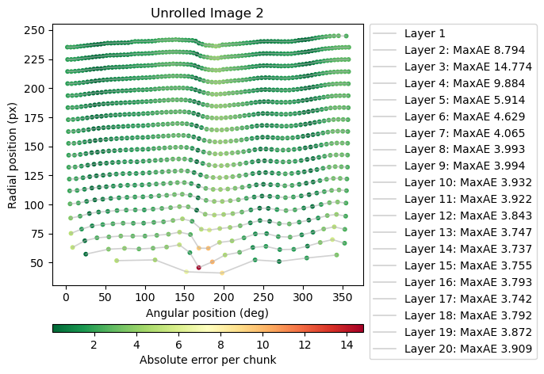

# Summary

X-ray computed tomography (XCT) enables non-destructive, 3D visualization of lithium-ion (Li-ion) battery components and microstructure. At the cell level, XCT is especially useful for detecting manufacturing and quality issues in Li-ion cells [@attia2025challenges]. Yet turning XCT images into quantitative, reproducible insights often requires custom analysis pipelines that are rarely shared openly.

This submission provides a set of open Jupyter notebooks that demonstrate analysis workflows for battery XCT data. The workflows target three critical quality-assurance tasks relevant to Li-ion cylindrical cells:

- Quantifying electrode overhang using multiple geometric measures;
- Measuring the canister (e.g., diameter, eccentricity) and detecting dents via ellipse fitting; and
- Unrolling 2D slices of the electrode winding into polar coordinates [@kok2019virtual] and fitting an ideal spiral to quantify deviations from the expected winding pattern [@sun2025health].

Each workflow is implemented as a Jupyter notebook and bundled with example data (images and, where appropriate, segmentation masks) so it can be run without specialized preprocessing. The notebooks are written in Python and rely on widely used scientific libraries; NumPy [@harris2020numpy], SciPy [@virtanen2020scipy], scikit-image [@van2014scikit], Matplotlib [@hunter2007matplotlib], and scikit-learn [@pedregosa2011scikit]. All materials are archived with a Zenodo DOI to ensure long-term accessibility.

By lowering the barrier to quantitative XCT analysis, these notebooks promote transparent, reproducible practice in battery science and provide adaptable templates for related problems in tomography and X-ray imaging.

# Statement of need

Although XCT is increasingly used to visualize battery structures and assess manufacturing quality, reproducible analysis workflows remain scarce. New users often stop at qualitative inspection, and many groups depend on proprietary software with limited documentation. This fragmentation complicates comparisons across studies and slows the adoption of best practices.

This contribution meets this need as a set of open, complete, and reproducible analysis workflows rather than a standalone software library. Because XCT analysis typically involves iterative exploration, visualization, and interpretation, Jupyter notebooks are a natural format: they combine executable code, results, and narrative explanation in one place. By sharing these notebooks, we aim to make quantitative XCT analysis easier to understand, adapt, and extend in both battery research and the broader tomography community.

# Illustrative outputs

  
*Figure 1. (a) Slice through a cylindrical cell tomogram with overhang masks overlayed. (b) Distribution of overhang deflection angles in the analysed cell. Overhang faults can lead to increased lithium plating and eventually short circuits.*  

  
*Figure 2. By fitting an ellipse to the cannister we can measure a range of quality metrics. For example, the fitted ellipse is used to calculate cannister eccentricity (a proxy for cannister deformation) and is also used to detect and measure dents (calculated as error with respect to the ellipse). Both deformation and denting of the cannister can lead to in-use safety issues.* 

  
*Figure 3. Cylindrical cell slice unrolled into polar coordinates and showing maximum absolute error (MaxAE) from a fitted spiral to detect buckling. In this case large buckles are detected in the central layers of the cell (layers 2 -4). Buckling is known to negatively effect capacity and is a known indicator of poor cell health.*  

# Acknowledgements

The authors would like to acknowledge the open-source Python scientific ecosystem (NumPy, SciPy, scikit-image, Matplotlib) that made this work possible.

This work was carried out with funding from the Faraday Institution (faraday.ac.uk; EP/S003053/1), grant numbers, FIRG060 and FIRG066; and the EPSRC grant EP/M014045/1. M.P.J. and R.J. acknowledged Innovate UK for funding via the BATSEED Project (grant number: 10044823). PhD funding for H.C.W.P by the Faraday Institution was also acknowledged: EPSRC training grant number EP/S514901/1. 

# References

